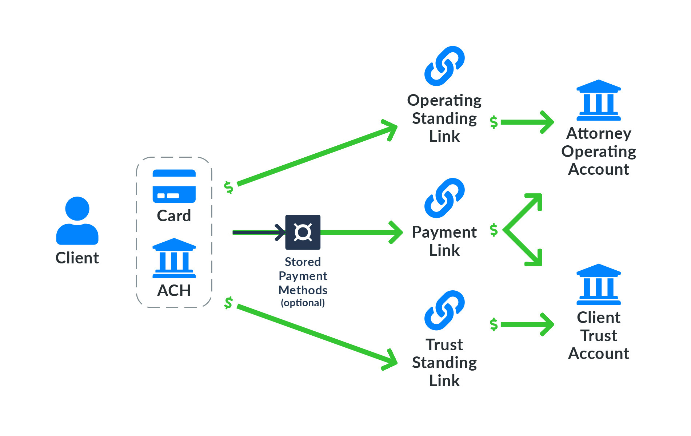

Gravity Legal allows individual attorneys or firms to collect client payments for services rendered or funds designated for a trust or IOLTA account. Firms may accept payments either via credit/debit card or direct bank transfer using a Payment Link or Standing Link. A Payment Link is created for a client whereas a Standing Link may be used by any number of clients. Clients may also securely store payment method details in a Stored Payment Method for future payments. The diagram below shows this.

Gravity Legal has built-in support for business processes specific to legal professionals such as strict demarcation of payments between operating and trust accounts, transfer of funds from trust to operating accounts and trust reconciliation by matter and client. Please refer to the product brief for additional information.
